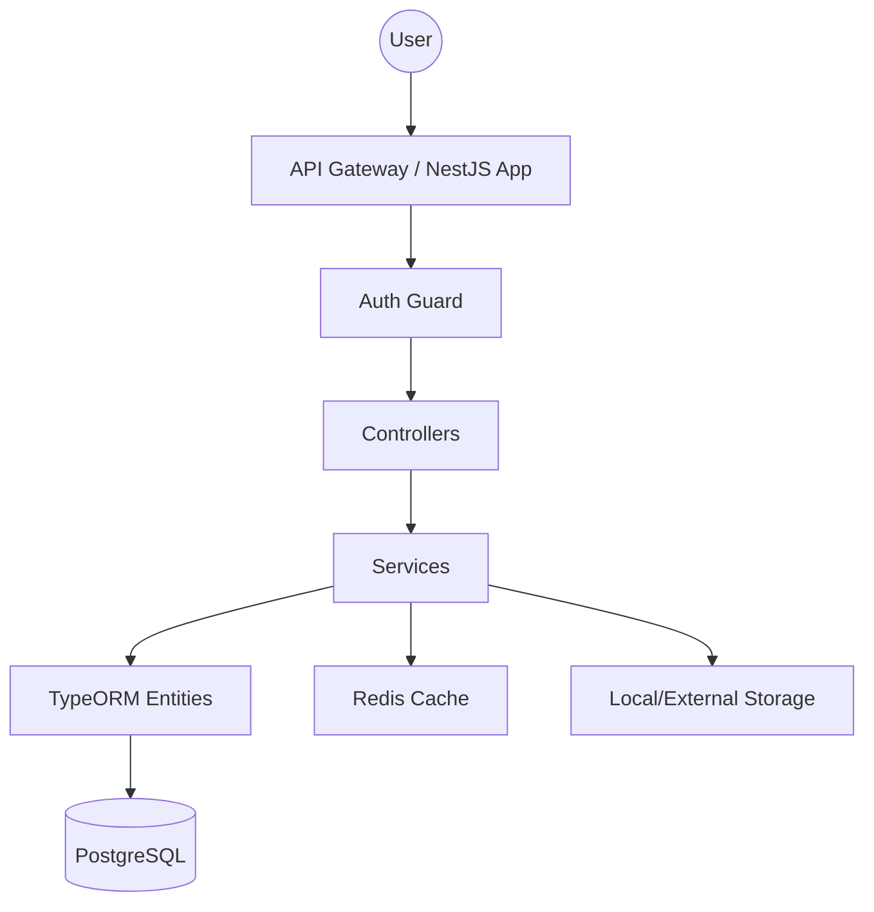

# Architecture

The LMS service follows a clean, modular architecture provided by NestJS, emphasizing separation of concerns and maintainability.

### Module Overview

The application is structured into several core modules:

- **Course Module**: Manages the high-level course entities and their metadata.
- **Module Module**: Handles the hierarchical grouping of lessons within courses.
- **Lesson Module**: Manages diverse content types and lesson delivery.
- **Enrollment Module**: Orchestrates user access and administrative workflows for course entry.
- **Tracking Module**: Records and processes all learner interactions and progress data.
- **Media Module**: Provides centralized management for assets like videos and documents.

### High-Level Flow

### Key Architectural Patterns
1. **Repository Pattern**: Abstracting database operations through TypeORM repositories.
2. **Dependency Injection**: Core to NestJS, ensuring loose coupling between components.
3. **Global Interceptors**: Used for consistent response formatting and performance monitoring.
4. **Exception Filters**: Centralized error handling across all microservice endpoints.
5. **DTOs (Data Transfer Objects)**: Strictly defining input/output schemas for all API interactions.
